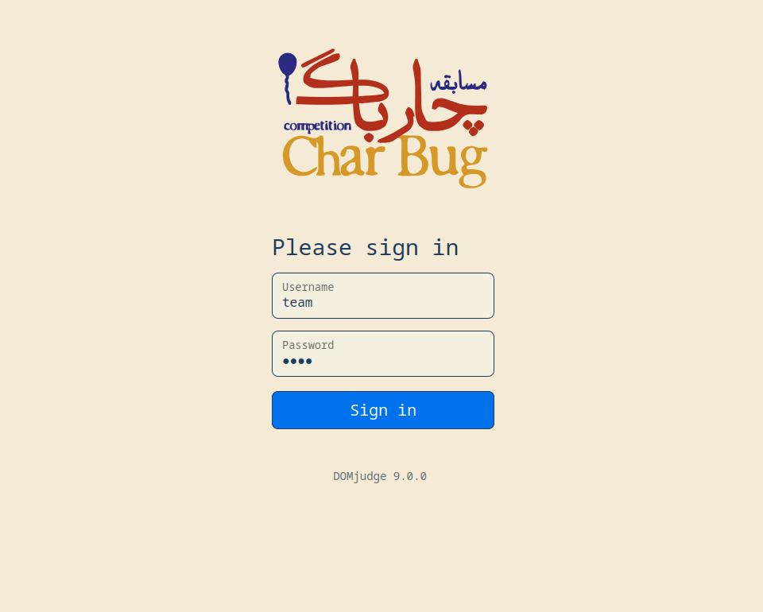
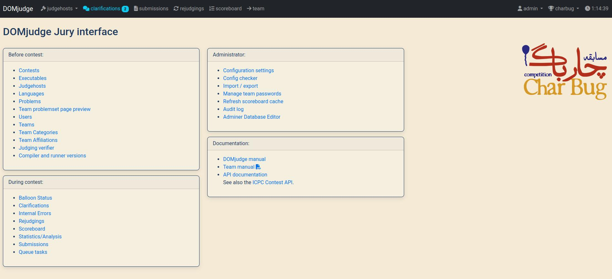
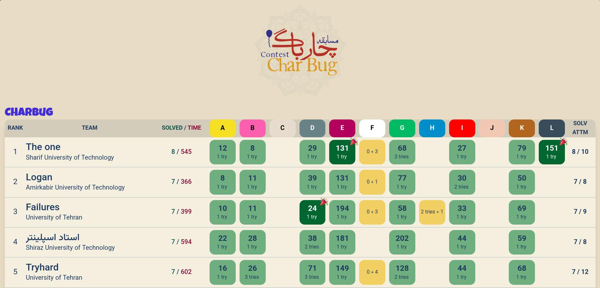
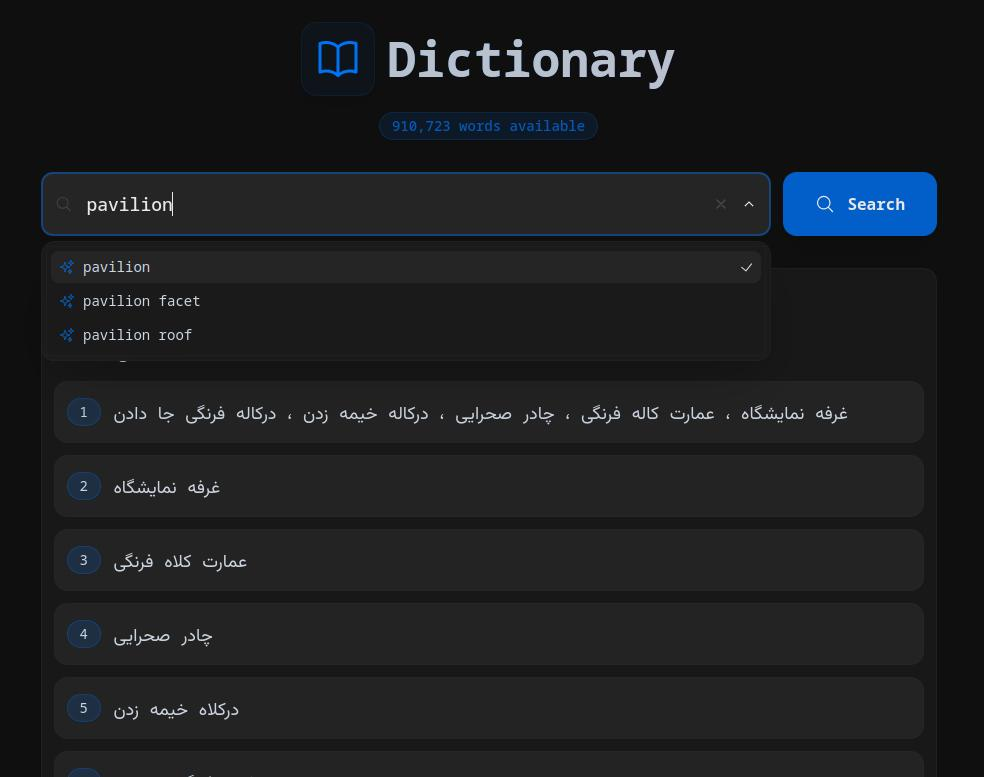

# CharBug-2 Operations

This repository contains the deployment files, scripts, and configurations used to set up **DOMjudge** and related infrastructure for the **second CharBug programming contest**, held on **November 27–28, 2025**, at the **University of Isfahan**.

For this contest, we utilized:
- **200 CPU cores**
- **180 GB RAM**
- **Three separate servers**:
  - One for the **website** (live scoreboard and landing page)
  - One for the **main DOMjudge system**
  - One for **contest clients**

---

## Clients

We used **kubernetes** and **VScode** for contest clients.  
Additionally, we developed a custom VS Code extension to simplify contest submissions:

[vscode-extension](https://github.com/domjudge-tools/vscode-extension)

---

## DOMjudge

We deployed **two `domserver` containers**:
- One for the **main contest system**
- One as a **shadow domserver** to separate **public live-scoreboard traffic** from the main contest traffic

We also applied the **official CharBug theme** to the DOMjudge interface.
We used  **Docker Compose** to manage the containers.

---

## Resolver

A custom **CharBug theme** was also added to the resolver.  
You can find the resolver repository here:

[Domjudge_resolver](https://github.com/domjudge-tools/resolver)

---

## Scripts

We developed several **Node.js automation scripts**, including:
- Team creation via the DOMjudge API
- Automatic password updates for teams based on a generated JSON file

**Known Issue:**  
The setPass scripts currently does **not** use the official DOMjudge API. I'll work on it.

## Dictionary

We used the following dictionary repository as part of the contest tooling and infrastructure:
[githubRepo](https:://github.com/mazaheriMahdi/dictionary)

## Special Thanks!

- The **CharBug technical team** [Mahdi](https://github.com/mazaheriMahdi), [Danial](https://github.com/dkhorasanizadeh),[Arash](https://github.com/ArashZrg),[Mohammad](https://github.com/MohammadHDehghani) :tnx guys Guys :heart_on_fire: , I learned a lot from this event, and I will never forget it.
- All **jury members** specially my dear friend [Mohammad Hossein](https://github.com/muhuchah) ,their effort in preparing high-quality contest problems.
- All **staff** for their continuous assistance during the contest ,_At the end of the day, they carry everything!_

## Other links
[Other scripts](https://github.com/domjudge-tools/bash-scripts)
[Domjudge automation](https://github.com/domjudge-tools/domjudge-automation)

## TODO
- [ ] Update the setPass script and make it work with api 
- [ ] Read and refactor the create theTeam 
- [ ] Add the link of domjudge-tools after update
- [ ] Add the script for update the pic in domjudge
